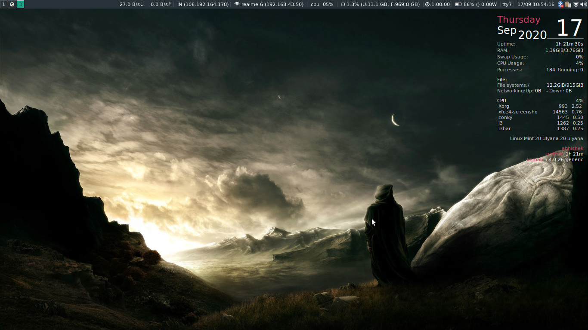
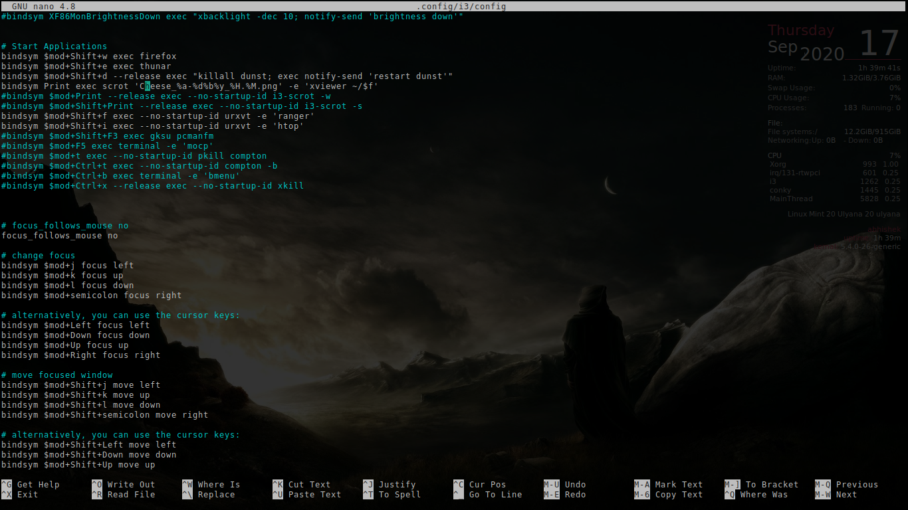
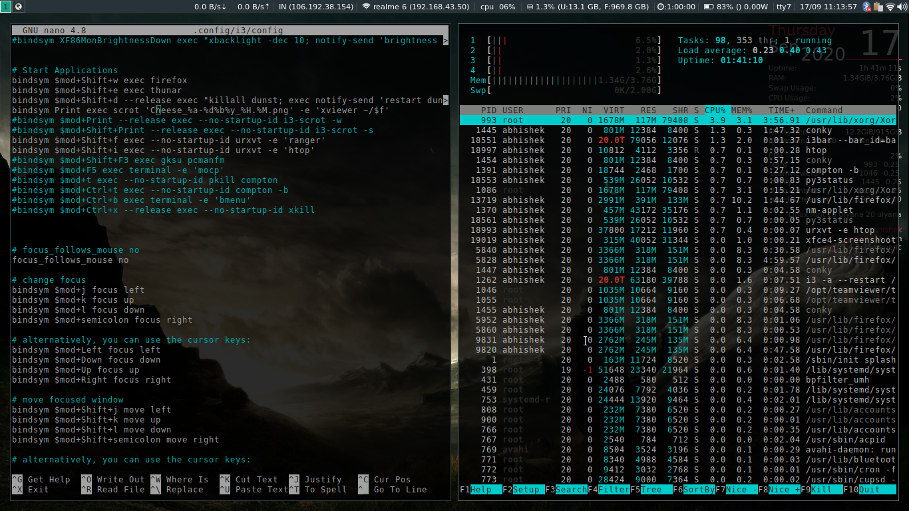
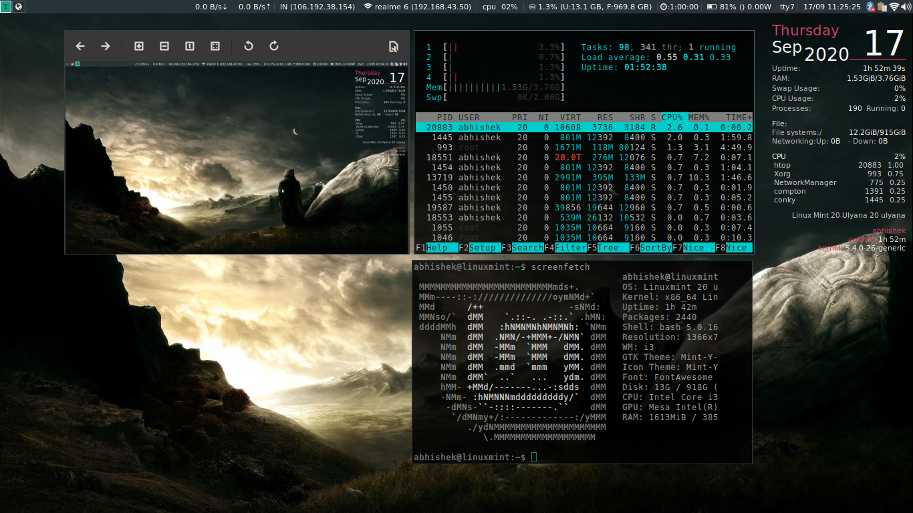

# i3-setup

## Intoduction 

This repo contain my config files for i3wm(a tiling window manager) and essentials packages that make them look eye candy.I have made changes as i like, you can change according to you. This is my daily i3 configuration by the way.
I'm using linux mint 20 (Ubuntu based linux) xfce4 edition.

## Sample Images

 my Deskotp without any opened app. only i3status and conky is visible.

 
 fullscreen image while editing this i3 config file.

 
 split screen image

 show off with floating windows.

## Additional note
I may have missed somethings while writing this file so just help yourself from internet and other places.
I have installed it on top of xfce. So I have made Alt Key as mod.
and i3-gaps(package to have gaps b/w windows) is not in main repo in ubuntu. Follow this  `https://benjames.io/2017/09/03/installing-i3-gaps-on-ubuntu-16-04/` tutorial to install it. 

## Intstallation 
   `sudo apt-get install i3`
   It will give You i3-wm, i3lock, i3blocks, i3status, and suckless-tools. If i3-wm, i3lock, i3blocks, i3status, and suckless-tools are not installed         automatically,just install them manually.
   `sudo apt-get install i3-wm i3lock i3status suckless-tools i3blocks`
    
   Install some additional packages to make your desktop enjoyable
   `sudo apt-get install compton nitrogen rxvt-unicode clipit rofi(dmenu alternative) fonts-noto xsettingsd lxappearance scrot viewnior`
    You can install some extra packages according to your need and if i have missed some. like conky. 
    
 ## Information of Additional Packages
   1. Compton is a compositor to provide some desktop effects like shadow, transparency, fade, and transiton.
   2. Nitrogen is a wallpaper handler. i3 has no wallpaper handler by default.
   3. URxvt is a lightweight terminal emulator, part of i3-sensible-terminal.
   4. clipit is a program to access X clipboard. We need it to make copy-paste in URxvt available. Hit Alt+C to copy, and Alt+V to paste.
   5. Rofi is a program launcher, similar with dmenu but with more options.
   6. fonts-noto package is to install fonts.Some other fonts are 
   7. Xsettingsd is a simple settings daemon to load fontconfig and some other options. Without this, fonts would look rasterized in some applications.
   8. LXAppearance is used for changing GTK theme icons, fonts, and some other preferences.
   9. Scrot is for taking screenshoot. I use it in my configuration for Print Screen button. I set my Print Screen button to take screenshoot using scrot, then   automatically open it using Viewnior image viewer. 
		
	
## Copy config to your directory
Install git befor cloning `sudo apt-get install git` and then type
`git clone https://github.com/Abhishek416/i3-setup.git` and copy .config/* to ~/.config/ 
but recommendation is to copy the configuration files one by one to make yourself have more control.
	 
Restart your i3 and enjoy it.
